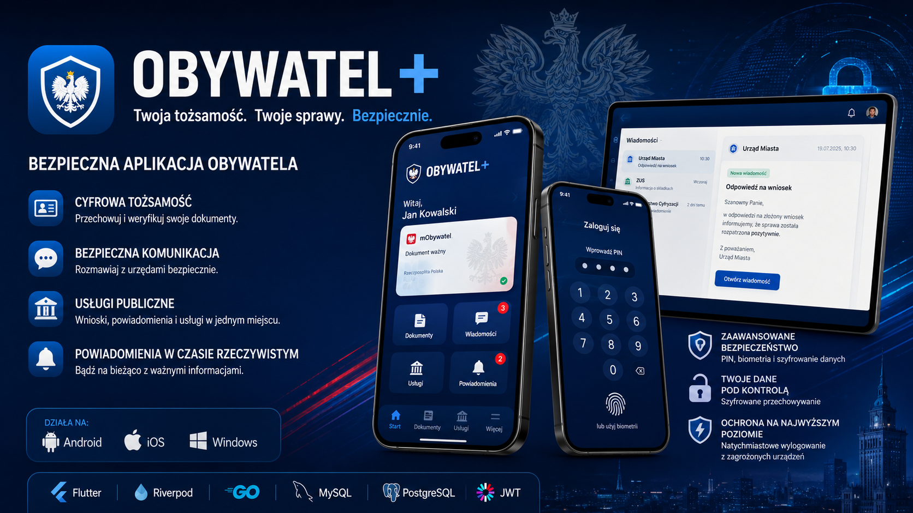

# Obywatel Plus (Obywatel+)

A **secure, multi-platform citizen application** designed for digital ID management, messaging, and government services.

---

## Features

- **Digital Identity** – Verify and store your official documents securely.
- **Secure Messaging** – Communicate with government offices safely.
- **Government Services** – Access applications, notifications, and public services in one place.
- **Multi-Platform** – Works on Android, iOS, and Windows.
- **Advanced Security** – PIN, biometrics, and encrypted storage.
- **Real-Time Notifications** – Stay up-to-date with official alerts.

## Tech Stack

- **Frontend:** Flutter + Riverpod
- **Backend:** GO - _Repository:_ [services_obywatel_app](https://github.com/ZeroDayZ7/services_obywatel_app)
- **Database:** MySQL, PostgreSQL
- **Authentication:** JWT + secure session management
- **State Management:** Riverpod

## Security Highlights

- Biometric login (Face/Touch ID) ⚠️ coming soon
- Encrypted local storage for sensitive data
- Immediate logout on compromised devices
- PIN protection with attempt throttling

## Architecture & Codebase Map

For a detailed breakdown of the application entry point, initialization sequence, lifecycle observers, and root widget tree, see the architecture guide:

- **[Architecture & Bootstrapping Overview](docs/INDEX.md)** — Step-by-step startup flow, service initialization, and security wrappers.

  

WIP

## License

MIT License – see [LICENSE](LICENSE) for details.
